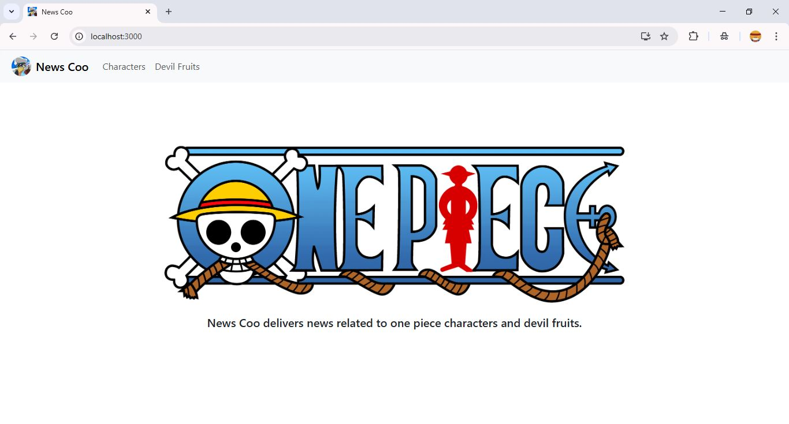
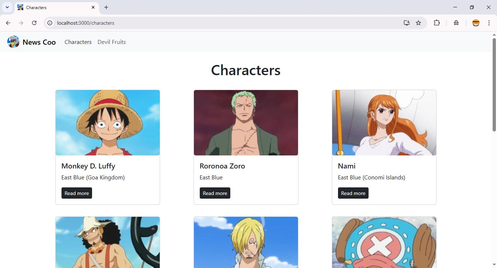
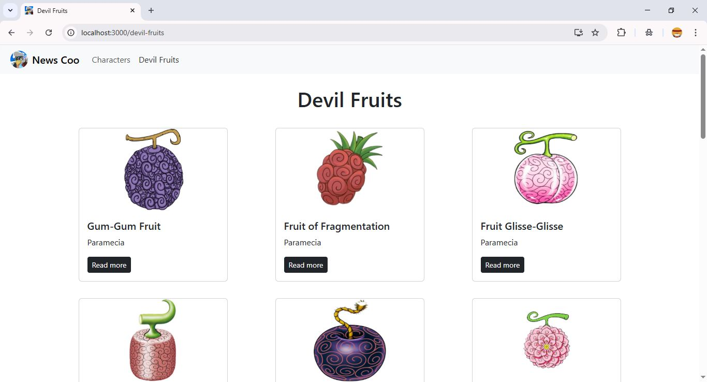

# News Coo

**News Coo** is a React project built as part of my learning journey to understand the class-based component life cycles, their associated methods and different React hooks.

## Screenshots

> Below are some screenshots of the project:







## Installation

Follow these steps to run News Coo React App locally on your machine.

1. Clone the repository:

   ```bash
   git clone https://github.com/NitikaMaharjan/News-Coo
   ```

2. Navigate to the project directory:

   ```bash
   cd News-Coo
   ```

3. Install the project dependencies:

   ```bash
   npm install
   ```

4. Start the development server:

   ```bash
   npm start
   ```

This will launch the app in your default browser at: `http://localhost:3000`.

## What I Learned

Through this project, I practiced and understood the following core React concepts:

- Creating **class-based components**
- Working with **constructor (with and without props)**
- Converting **class-based components to function-based components**
- Fetching data from a **REST API**
- Using the **useState hook** for state management
- Using the **useEffect hook** for handling side effects
- Using **async/await and setTimeout**
- Integrating **Bootstrap** for styling
- Setting up **routing with `react-router-dom`**

## Acknowledgements

This project was created while following the **React JS tutorials by [CodeWithHarry](https://www.youtube.com/playlist?list=PLu0W_9lII9agx66oZnT6IyhcMIbUMNMdt)** on YouTube. Big thanks to him for creating beginner-friendly and engaging tutorials!

## Contact Me

Created by [Nitika Maharjan](https://github.com/NitikaMaharjan)

Feel free to connect with me on GitHub or reach out for collaboration!